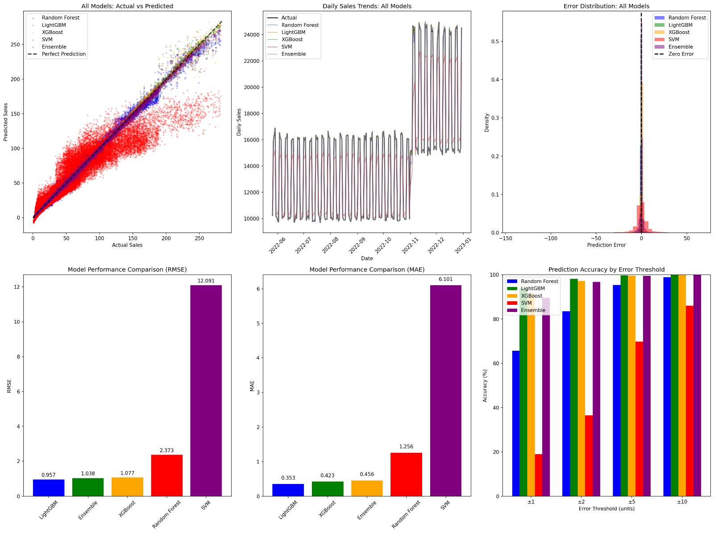
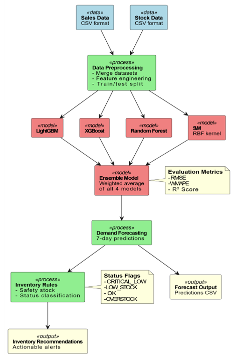
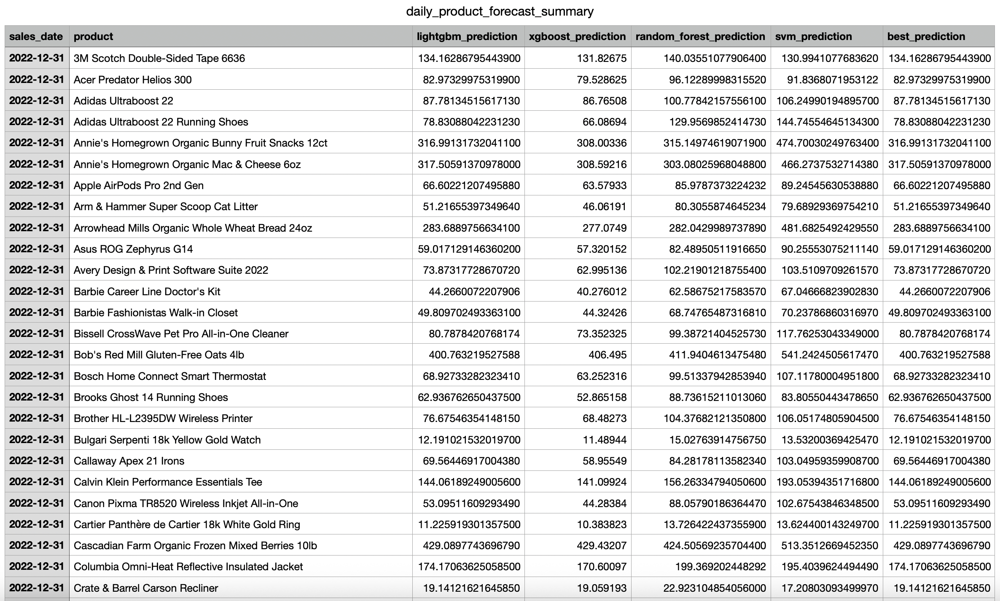
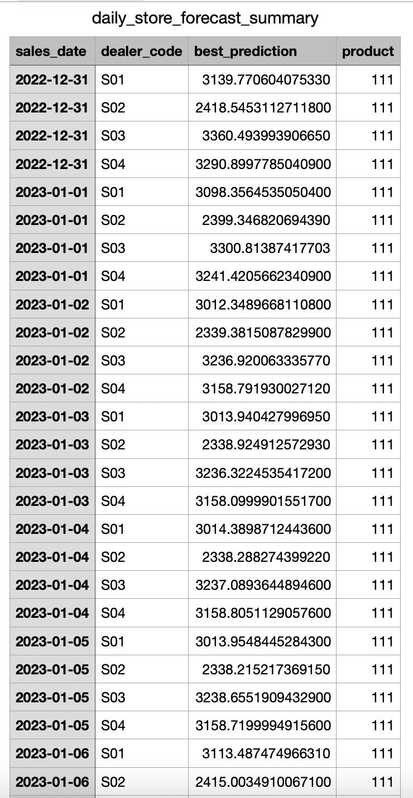
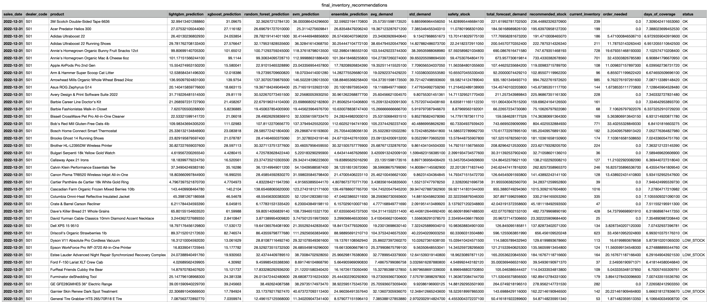
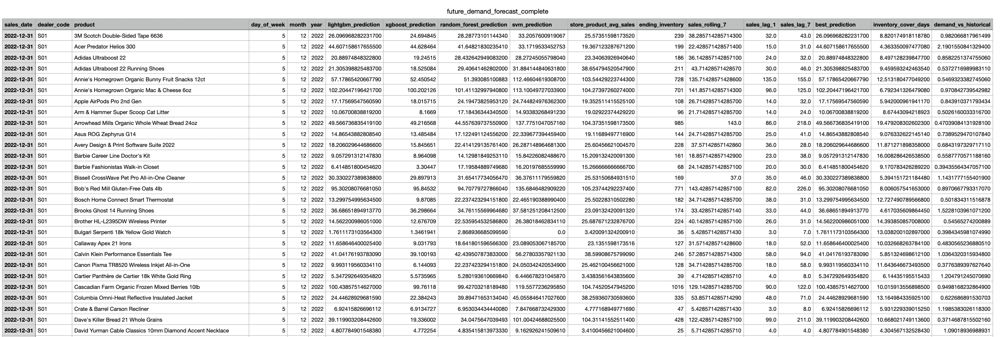

# CS613: Machine-Learning
# Demand Forecasting

## About The Project
The main aim of this project is to make sure each shop receives the right amount of stock at the right time. It focuses on avoiding situations where a shop runs out of products and loses customers, while also preventing sending more stock than the shop can realistically sell. In simple terms, the objective is to maintain a healthy balance—not too much, not too little—so that shops can operate smoothly, meet customer demand, and avoid unnecessary costs or wastage.

## Built With
This project is developed using the following technologies:
* Python
* Pandas
* NumPy
* Scikit-learn
* LightGBM
* XGBoost
* Matplotlib & Seaborn 
* Jupyter Notebook

## Getting Started
To get a local copy up and running follow these steps.

### Prerequisites
Before you begin, ensure you have the following installed:
* Python 3.10 or higher
* Jupyter Notebook / JupyterLab
* pip (Python package installer)

To install Jupyter Notebook:
```sh
  pip install notebook
  ```
To verify Python version:
```sh
  python --version
  ```

## Installation
Follow these steps to run the project on your machine:
1. Clone the repository
   ```sh
   git clone https://github.com/khushiipatel/FinalProjectML.git 
   ```
2. Navigate into the project
   ```sh
   cd repo_name
   ```
3. Open Jupyter Notebook
   ```sh
   jupyter notebook 
   ```
4. Open the project file
Inside Jupyter, open:
   ```sh
   Project.ipynb 
   ```
5. Run all cells

## Dataset
* The dataset is taken from the Google Cloud public Marketplace in Big Query.​
* **Sales Data**: Daily sales transactions​
   * Fields: sales_date, dealer_code, product, qty, total_price​
* **Stock Data**: Daily inventory snapshots​
   * Fields: benchmark_date, ec_id, product_name, inventory_qty​
* **Scale**: Multiple stores × multiple products × daily timestamps​
* **Preprocessing**: Merged datasets, handled missing values, created time-series structure.

## Visualization
This visualization helps identify which model most accurately predicts daily demand across all products for each of the 7 days, enabling better decision‑making for inventory and resource planning.


For detailed model experiments, evaluation metrics, and performance comparisons, please refer to the [Documentation](./Documentation_DemandForecasting.pdf)

## System Architecture


## Machine Learning Models used
* LightGBM;
* Support Vector Regression (SVR);
* Complementary Models: XGBoost & Random Forest;
* Ensemble Strategy
 
## Results
### Model Performance
**Model** | **RMSE** | ***MAE*** | **WMAPE**
| :--- | ---: | ---: | :---:
LightGBM       | 0.9573  | 0.3531  | 1.09%
XGBoost        | 1.0774  | 0.4227  | 1.30%
Random Forest  | 2.3733  | 1.2565  | 3.86%
SVM(RBF)       | 12.0908 | 6.1007  | 18.76%
ESEMBLE        | 1.0383  | 0.4559  | 1.40%

LightGBM achieved the best overall performance with the lowest RMSE and WMAPE.

## Output





## Example Use Cases 
This demand forecasting system helps businesses make better inventory decisions:

* **Reduce missed sales from stockouts** by identifying which products are likely to run out and need restocking soon.
* **Minimize waste from overstock** by detecting products with excess inventory before they become obsolete.
* **Optimize inventory costs** by planning purchasing cycles to keep just enough stock without tying up too much capital.
* **Improve customer satisfaction** by ensuring popular products are always available when customers want to buy them.

### Top Contributors

<a href="https://github.com/khushiipatel/FinalMLProject/graphs/contributors">
  
</a>

#### Contributor Profiles:
- **Khushi Patel** - [@khushiipatel](https://github.com/khushiipatel)
- **Srir** - [@srir-2002](https://github.com/srir-2002)
- **Manjiri** - [@manjiri5461](https://github.com/manjiri5461)
- **Mokshu** - [@Mokshu3242](https://github.com/Mokshu3242)

## References
H. Malik, "A beginner's approach to time-series with working example: Demand forecasting │ Time series example with Kaggle," Medium, Jun. 11, 2024. [Online]. Available: https://medium.com/@humzahmalik/a-beginners-approach-to-time-series-with-working-example-c6bff9c24928

## License
This project was completed as part of academic coursework for CS613: Machine Learning.
